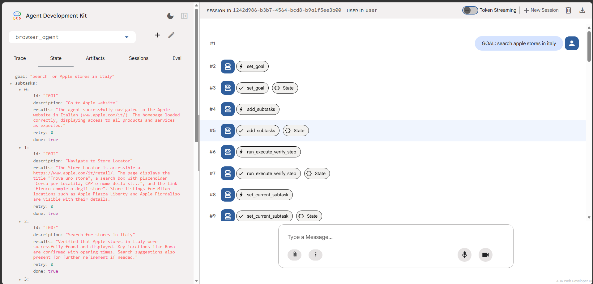

# ADK Multimodal Browser Agent

A multimodal, multi-agent system for autonomous web browsing on **real, unmodified websites**. Built on [Google ADK](https://github.com/google/adk-python) and [Playwright](https://playwright.dev/), it combines visual perception (screenshots) with structured DOM retrieval (FAISS + SentenceTransformers) in a three-agent architecture — Planner, Executor, Verifier — evaluated on a 74-task benchmark derived from GAIA, WebVoyager, and custom scenarios.

---

## Results

Five model × prompt configurations were evaluated on a 74-task benchmark using an LLM-as-a-Judge with a retry protocol (tasks are retried until score plateaus at Δ=0 for two consecutive rounds).

| Configuration | TSR | Rounds | Avg. attempts/task |
|---|---|---|---|
| Qwen3.5-9B + seed prompt | 0.649 | 9 | ~3.4 |
| Qwen3.5-9B + GEPA-35B prompt | 0.662 | 7 | ~3.3 |
| Qwen3.5-9B + GEPA-9B prompt | 0.757 | 8 | ~3.3 |
| Qwen3.6-35B-A3B + seed prompt | 0.676 | 6 | ~2.9 |
| **Qwen3.6-35B-A3B + GEPA-35B prompt** | **0.865** | **6** | **~2.7** |

**TSR** = Task Success Rate (fraction of 74 tasks judged correct). **Rounds** includes the initial single-shot run plus all retry cycles.

Key findings:
- **Prompt optimization dominates model size**: GEPA-optimized prompts yield +18.9 pp on 35B and +10.8 pp on 9B, while the raw model size gap (35B vs 9B, same seed prompt) is only +2.7 pp.
- **In-domain GEPA outperforms cross-deployment**: GEPA-9B (optimized on 9B) reaches 0.757, vs 0.662 for GEPA-35B cross-deployed to 9B (+9.5 pp).
- **Single-shot advantage**: 9B+GEPA-9B starts at 0.487 (vs 0.378 cross and 0.338 seed), suggesting the optimized prompt improves even zero-retry performance.

Full per-category breakdown, the 9B convergence chart, and reproduction notes are in [`docs/RESULTS.md`](docs/RESULTS.md).

---

## Architecture

```
User Request
     │
     ▼
┌─────────────────────────────────┐
│   Planner (root LlmAgent)       │  ← goal decomposition, subtask queue
│   Tools: set_goal, add_subtasks,│
│   complete_session,             │
│   run_execute_verify_step       │
└──────────────┬──────────────────┘
               │ AgentTool (SequentialAgent)
       ┌───────┴────────┐
       ▼                ▼
┌───────────┐   ┌──────────────┐
│ Execution │   │ Verification │
│   Agent   │   │    Agent     │
│  Browser  │   │  Validates   │
│   Tools   │   │   Results    │
└───────────┘   └──────────────┘
```

The Planner maintains a `SessionState` (goal → subtask queue → current subtask → final answer) in the ADK session. It delegates browser work to the execute-verify pipeline and only calls `complete_session` once a verified answer is available.

### Key components

- **Multimodal observation**: every Executor step receives the current URL, an interactive DOM element list, a JPEG screenshot, and scroll metrics.
- **Semantic DOM retrieval (RAG)**: noisy pages are pruned via FAISS + `all-MiniLM-L6-v2`; only the top-30 semantically relevant elements are forwarded to the model, reducing hallucination on element IDs.
- **Event compaction**: a sliding-window summarizer (window=4, overlap=1) keeps the Planner's event history within model token budgets on long trajectories.
- **Iteration control**: the Executor hard-stops at 40 iterations and emits a structured diagnostic (`status: max retries reached`) that the Planner can use to replan.
- **Tool validation callbacks**: `validate_planner_tools` and `validate_execution_tools` enforce that each agent can only call its own tool set, preventing cross-agent tool leakage.

---

## GEPA Prompt Optimization

Planner prompts are optimized with [GEPA](https://github.com/gepa-ai/gepa) ([paper](https://arxiv.org/abs/2507.19457)), a reflective prompt optimizer that runs the agent on a training set, lets a *reflection LM* analyze failures, mutates the prompt, and keeps the best candidate against a validation set.

Two optimization campaigns were run:

| Campaign | Model | Candidate accepted | Val-set (seed → pareto front) |
|---|---|---|---|
| `gepa_35b_s1` | Qwen3.6-35B-A3B | iter 4 | 0.435 → 0.478 |
| `gepa_9b_s2` | Qwen3.5-9B | iter 4 | 0.400 → 0.467 |

The internal GEPA validation set is small (23 tasks for 35B, 15 for 9B), so the candidates' decisive advantage appears on the full 74-task benchmark rather than on the GEPA val-set (see Results above). The val-set figures above are the pareto-front aggregate vs the seed baseline.

The GEPA-35B candidate fixes a specific failure mode: the model completed navigation and found the correct answer, but returned meta-strings (`"Session completed"`, `"Browser closed"`) as `final_answer` instead of the actual value. The GEPA-9B candidate adds three task-specific rules derived from 9B failure traces: explicit transport-mode specification for routing tasks, fallback behavior for dynamic pricing forms, and mandatory solver-based extraction for symbolic math tasks.

```bash
cd optimization
python gepa_optimization.py \
  --csv ../evaluation/data/dataset_unified.csv \
  --max_metric_calls 60 \
  --reflection_minibatch_size 4 \
  --headless
```

Best prompts are saved to `optimization/best_prompts/`. To activate a candidate, copy its content into `browser_agent/prompt.py` → `planner_prompt`.

See [`optimization/README.md`](optimization/README.md) for the full pipeline: reflection/judge LM configuration, resume from a saved state, session chaining, and the dataset schema.

---

## Dataset

The benchmark (`evaluation/data/dataset_unified.csv`) contains 74 tasks across 10 web categories. Each task requires the agent to **navigate live sites, interact with the page (search, click, fill forms, switch tabs, scroll) and extract the answer** — not to answer from parametric knowledge or hit an API:

| Category | N | Example agent tasks |
|---|---|---|
| Wolfram Alpha | 18 | Submit integrals & polynomial simplifications and read back the result; look up physics/chemistry quantities |
| GAIA (L1/L2) | 12 | Multi-hop navigation across pages, decode a ciphered message, cross-reference obscure facts |
| Google Search | 10 | Search then open results to extract sports records, movie release dates, device specs |
| GitHub | 7 | Navigate repos to inspect contributors and recent commits, read pricing tiers |
| Apple | 7 | Browse product pages to compare prices/chips/specs, look up an iPhone trade-in value |
| CUSTOM | 6 | Follow scripted multi-step click-through flows (incl. new-tab handling), map lookups |
| Google Maps | 5 | Search places, compute walking routes, filter by opening hours |
| Coursera | 4 | Search & filter courses by level/duration, enumerate a specialization's contents |
| ArXiv | 3 | Run advanced search with date filters, count paper authors, navigate Help pages |
| Hugging Face | 2 | Filter models by license/likes, read account pricing and features |

Tasks are sourced from GAIA and WebVoyager benchmarks, extended with custom scenarios targeting agent-specific failure modes. Each row has an `enabled` column (`True`/`False`) to support incremental retry campaigns without modifying the dataset.

---

## Project Structure

```
adk-multimodal-browser-agent/
├── browser_agent/
│   ├── agent.py               # Root agent and ADK app setup
│   ├── prompt.py              # Planner, Executor, Verifier prompts
│   ├── state.py               # SessionState and Subtask dataclasses + tools
│   ├── browser.py             # BrowserManager (Playwright, FAISS DOM search)
│   ├── callbacks.py           # Tool validation, retry, iteration limits
│   ├── event_compaction.py    # Sliding-window event summarizer
│   ├── dom_retriever.py       # FAISS-based semantic element retrieval
│   └── subagents/
│       ├── execution_agent.py
│       └── verification_agent.py
├── evaluation/
│   ├── run_test.py            # Batch task runner (CSV → results.jsonl)
│   ├── run_eval.py            # LLM-judge evaluation (results.jsonl → report)
│   └── data/
│       └── dataset_unified.csv
└── optimization/
    ├── gepa_optimization.py   # GEPA prompt optimizer
    └── gepa_eval_sets.py      # Dataset split utilities
```

---

## Setup

### Prerequisites

- Python 3.11+
- A compatible LLM endpoint (OpenRouter, local Ollama, or any OpenAI-compatible API)

### Install

```bash
git clone https://github.com/Agostino-M/adk-multimodal-browser-agent.git
cd adk-multimodal-browser-agent
pip install -r requirements.txt
playwright install chromium
```

### Configure

Create `browser_agent/.env` (the agent loads it from there automatically):

```env
MODEL_NAME=openai/qwen/qwen3-8b        # any OpenAI-compatible model ID
API_BASE=https://openrouter.ai/api/v1   # or http://localhost:11434/v1 for Ollama
API_KEY=sk-...

# Optional
SHOW_BROWSER=true          # false for headless
HF_TOKEN=hf_...            # required on first run (downloads SentenceTransformer)
```

Create a separate `evaluation/.env` for the LLM judge (can point to a different model/endpoint).

---

## Usage

### Interactive (dev UI)

```bash
adk web
```

Open `http://localhost:8080`, select `browser_agent`, and submit a task as a chat message.

### Batch evaluation

```bash
python evaluation/run_test.py \
    --csv_file evaluation/data/dataset_unified.csv \
    --output evaluation/results.jsonl \
    --timeout 2000 \
    --headless
```

| Flag | Default | Description |
|---|---|---|
| `--csv_file` | `./data/dataset_unified.csv` | Input task dataset |
| `--output` | `results.jsonl` | Output JSONL (written incrementally) |
| `--timeout` | 2700 | Seconds per task |
| `--headless` | false | Run browser without UI |
| `--web_names` | all | Filter by category, e.g. `GAIA,Apple` |
| `--n_test` | all | Limit number of tasks |

### Score results

```bash
python evaluation/run_eval.py \
    --results evaluation/results.jsonl \
    --csv_file evaluation/data/dataset_unified.csv \
    --output evaluation/evaluation_report.json
```

The judge applies lenient scoring: numeric precision tolerance, equivalent format matching (`17 thousand` = `17000`), and typo forgiveness.

### Retry protocol

To reproduce the retry campaigns reported above, disable already-passing tasks in the CSV (`enabled=False`) and re-run `run_test.py` on the remaining tasks. Repeat until two consecutive rounds show Δ=0 new passes.

---

## Browser Tools

| Tool | Description |
|---|---|
| `get_state` | Returns URL, interactive DOM elements, screenshot, scroll metrics |
| `goto_url` | Navigate to a URL |
| `click` | Click by text, CSS selector, or coordinates |
| `type` | Type into an input field |
| `select_option` | Select a dropdown option by value, label, or index |
| `hover` | Hover over an element to trigger UI |
| `extract_content` | Read visible text from the page or a specific element |
| `scroll` | Scroll by step, percentage, pixels, or to a target element/text |
| `press_key` | Send keyboard input (single keys or combinations) |
| `switch_page` | Switch between open browser tabs |
| `wait` | Pause execution (default 5 s) |
| `close` | Close the browser and clean up resources |

---

## Observability

During development, the ADK dev UI (`adk web`) exposes the live `SessionState` and the event stream (tool calls, model responses) for the root agent:



For production tracing, the agent integrates with [Langfuse](https://langfuse.com/) for distributed trace logging across the three-agent pipeline (the dev UI only shows the root agent; the Executor–Verifier pipeline appears as a single aggregated tool call). Add to `.env`:

```env
LANGFUSE_PUBLIC_KEY=pk-...
LANGFUSE_SECRET_KEY=sk-...
LANGFUSE_HOST=https://cloud.langfuse.com
```

---

## Citation

If you use this system in your research, please cite:

```bibtex
@mastersthesis{messina2026adk,
  author  = {Agostino Messina},
  title   = {Design e ottimizzazione di un web agent multimodale autonomo
             per esecuzione di task complessi},
  school  = {Università degli Studi di Palermo},
  type    = {Tesi di Laurea Magistrale in Ingegneria Informatica},
  address = {Dipartimento di Ingegneria},
  year    = {2026},
  note    = {Relatore: Marco La Cascia. Correlatore: Salvatore Cipolla.
             Anno accademico 2025--2026},
}
```
