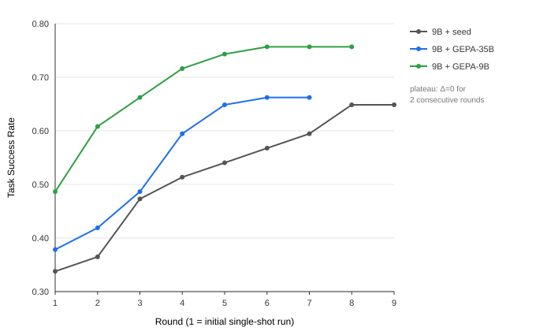

# Experimental Results

Full results for the five model × prompt configurations evaluated on the 74-task benchmark, under the exhaustive retry protocol (a round is added until two consecutive rounds yield zero net new passes — Δ=0 — the plateau). Scores are Task Success Rate (TSR): fraction of tasks judged correct by the LLM-as-a-Judge.

These figures are reproduced from the thesis *"Design e ottimizzazione di un web agent multimodale autonomo per esecuzione di task complessi"* (Università degli Studi di Palermo, 2026).

## Aggregate score

| Configuration | TSR | Passed | Rounds | Avg. attempts/task |
|---|---|---|---|---|
| Qwen3.5-9B + seed prompt | 0.649 | 48/74 | 9 | ~3.4 |
| Qwen3.5-9B + GEPA-35B prompt | 0.662 | 49/74 | 7 | ~3.3 |
| Qwen3.5-9B + GEPA-9B prompt | 0.757 | 56/74 | 8 | ~3.3 |
| Qwen3.6-35B-A3B + seed prompt | 0.676 | 50/74 | 6 | ~2.9 |
| **Qwen3.6-35B-A3B + GEPA-35B prompt** | **0.865** | **64/74** | 6 | ~2.7 |

**Rounds** includes the initial single-shot run plus all retry cycles. **Attempts/task** is the cumulative count of non-ERROR runs divided by 74, an approximate effort metric.

## Convergence of the 9B configurations

The in-domain GEPA-9B prompt leads from the first single-shot run (0.487 vs 0.378 for the cross-deployed GEPA-35B and 0.338 for the seed) and keeps a margin through convergence. Per-round net gains for GEPA-9B: +9, +4, +4, +2, +1, then two Δ=0 rounds confirming the plateau at 56/74.

## Pass rate per category

| Category | N | 9B+seed | 9B+GEPA-35B | 9B+GEPA-9B | 35B+seed | 35B+GEPA |
|---|---|---|---|---|---|---|
| Wolfram Alpha | 18 | 16 (89%) | 16 (89%) | 17 (94%) | 16 (89%) | **18 (100%)** |
| GAIA | 12 | 5 (42%) | 6 (50%) | 7 (58%) | 8 (67%) | 9 (75%) |
| Google Search | 10 | 7 (70%) | 7 (70%) | **10 (100%)** | 7 (70%) | 9 (90%) |
| GitHub | 7 | 7 (100%) | 7 (100%) | 7 (100%) | 6 (86%) | 7 (100%) |
| Apple | 7 | 3 (43%) | 3 (43%) | 3 (43%) | 4 (57%) | 3 (43%) |
| CUSTOM | 6 | 3 (50%) | 2 (33%) | 3 (50%) | 3 (50%) | 5 (83%) |
| Google Maps | 5 | 3 (60%) | 3 (60%) | 3 (60%) | 3 (60%) | **5 (100%)** |
| Coursera | 4 | 2 (50%) | 2 (50%) | 3 (75%) | 2 (50%) | **4 (100%)** |
| ArXiv | 3 | 1 (33%) | 1 (33%) | 1 (33%) | 0 (0%) | 2 (67%) |
| Hugging Face | 2 | 1 (50%) | 2 (100%) | 2 (100%) | 1 (50%) | **2 (100%)** |
| **Total** | **74** | **48 (64.9%)** | **49 (66.2%)** | **56 (75.7%)** | **50 (67.6%)** | **64 (86.5%)** |

## Key findings

- **Prompt optimization dominates model size.** GEPA-optimized prompts yield +18.9 pp on the 35B (0.676 → 0.865) and +10.8 pp on the 9B (0.649 → 0.757), while the raw model-size gap (35B vs 9B on the same seed prompt) is only +2.7 pp. When inference resources are the binding constraint, optimizing the prompt beats upgrading the model.
- **In-domain GEPA beats cross-deployment.** The GEPA-9B candidate (optimized on the 9B) reaches 0.757, vs 0.662 for the GEPA-35B candidate cross-deployed to the 9B (+9.5 pp), and even surpasses the 35B+seed baseline (0.676).
- **The 35B gain is structural, not single-mode.** The +14 net tasks on the 35B are distributed across nearly every category (five reach 100%), not concentrated on the `final_answer` formatting failure mode the candidate primarily targets.

## Reproducing

The retry protocol and judge configuration are documented in [`../evaluation/README.md`](../evaluation/README.md). Scores depend on the specific benchmark composition and are subject to environmental flakiness (site layout drift, network, CAPTCHAs); the exhaustive retry protocol reduces run-to-run variance but does not eliminate it.
